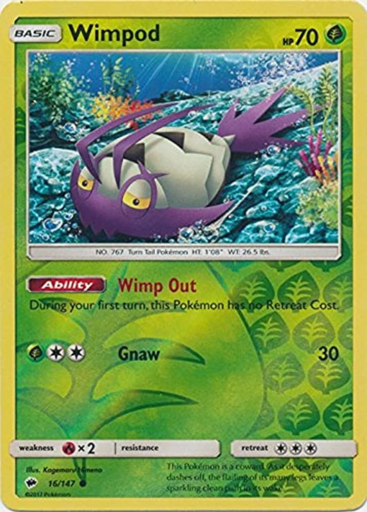

<html lang="en">
  <head>
    <!-- Required meta tags -->
    <meta charset="utf-8">
    <meta name="viewport" content="width=device-width, initial-scale=1, shrink-to-fit=no">

    <!-- Bootstrap CSS -->
    <link rel="stylesheet" href="https://stackpath.bootstrapcdn.com/bootstrap/4.1.3/css/bootstrap.min.css" integrity="sha384-MCw98/SFnGE8fJT3GXwEOngsV7Zt27NXFoaoApmYm81iuXoPkFOJwJ8ERdknLPMO" crossorigin="anonymous">

    <!-- My Fonts -->
    <link href="https://fonts.googleapis.com/css2?family=Viga" rel="stylesheet">
    <link href="https://fonts.googleapis.com/css2?family=Akaya+Telivigala&family=Viga" rel="stylesheet">

    <!-- My CSS -->
    <link rel="stylesheet" href="style.css">

    <title>Gauri Janaki</title>
    <link rel="icon" href="img/kidungutama.jpg" type="image/x-icon">

  </head>
  
  <body>
   
    <!-- Navbar -->
    <nav class="navbar navbar-expand-lg navbar-light">
      

        <a class="navbar-brand" href="#">BangLipur</a>
        <button class="navbar-toggler" type="button" data-toggle="collapse" data-target="#navbarNavAltMarkup" aria-controls="navbarNavAltMarkup" aria-expanded="false" aria-label="Toggle navigation">
          
        </button>
        

          

            <a class="nav-item nav-link active" href="#">Home (current)</a>
            <a class="nav-item nav-link" href="#">Features</a>
            <a class="nav-item nav-link" href="#">About Us</a>
            <a class="nav-item nav-link" href="#">Contact Us</a>
            <a class="nav-item btn btn-primary tombol font-weight-bold" href="#">Login</a>
          

        

      

    </nav>
    <!-- Akhir Navbar -->

    <!-- Jumbotron -->
    

      

        <h1 class="display-4">Culture of the Mind must be  subservient to the Heart</h1>
        
“People without the knowledge of their past history, origin and culture is like a tree without roots.”

        <a href="" class="btn btn-primary tombol-1">Bang Lipur</a>
      

    

    <!-- akhir Jumbotron -->

    <!-- Container -->
    

        <!-- Info Panel -->
        

          

            

              

                
                <h4>Buku Cerita</h4>
                
Lorem ipsum dolor sit amet.

              

                

                  
                  <h4>kartu Tempur</h4>
                  
Lorem ipsum dolor sit amet.

                

                  

                    
                    <h4>Barcode</h4>
                    
Lorem ipsum dolor sit amet.

                  

              

            

          

        

        <!-- akhir Info Panel -->

        <!-- Workingspace -->
        

          

            
          

          
          

            <h3> Cintai Budaya Nusantara</h3>
            
 “Culture is the widening of the mind and of the spirit.” 

            <a href="" class="btn btn-primary tombol">Gallery</a>
          

        

        <!-- akhir Workingspace -->

        <!-- Footer -->
          

            

              
2021 All Rights Reserved by Gauri Janaki ft Kemah Budaya

            

          

        <!-- akhir Footer -->

    

    <!-- akhir Container -->

    <!-- Optional JavaScript -->
    <!-- jQuery first, then Popper.js, then Bootstrap JS -->
    
    
    
  </body>

